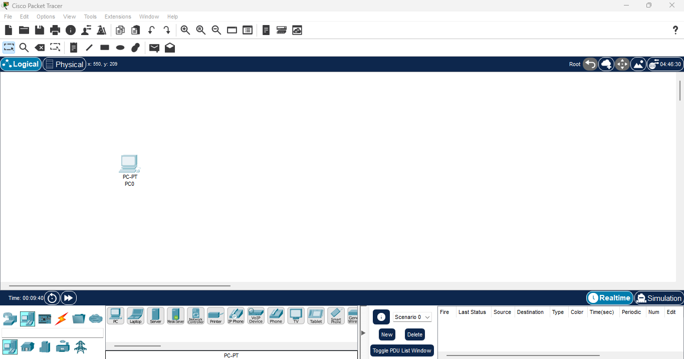
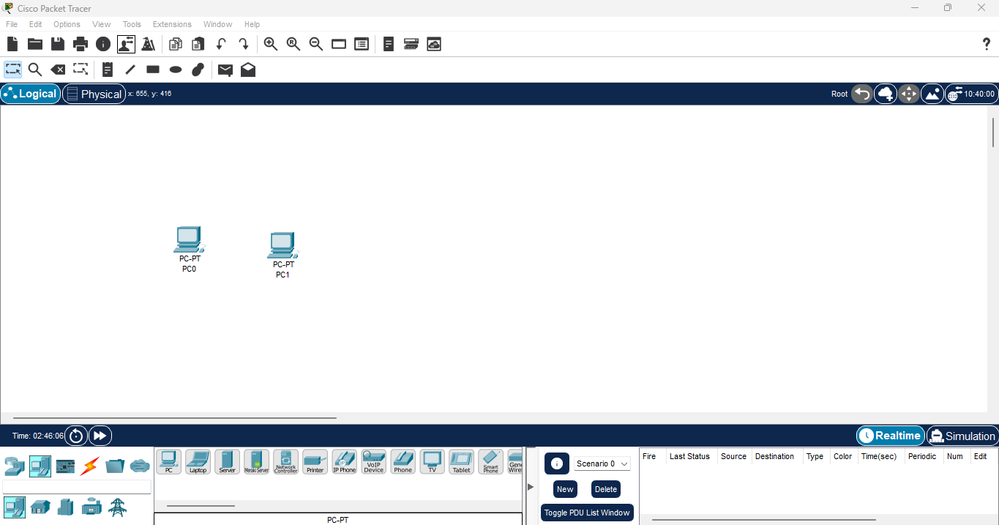
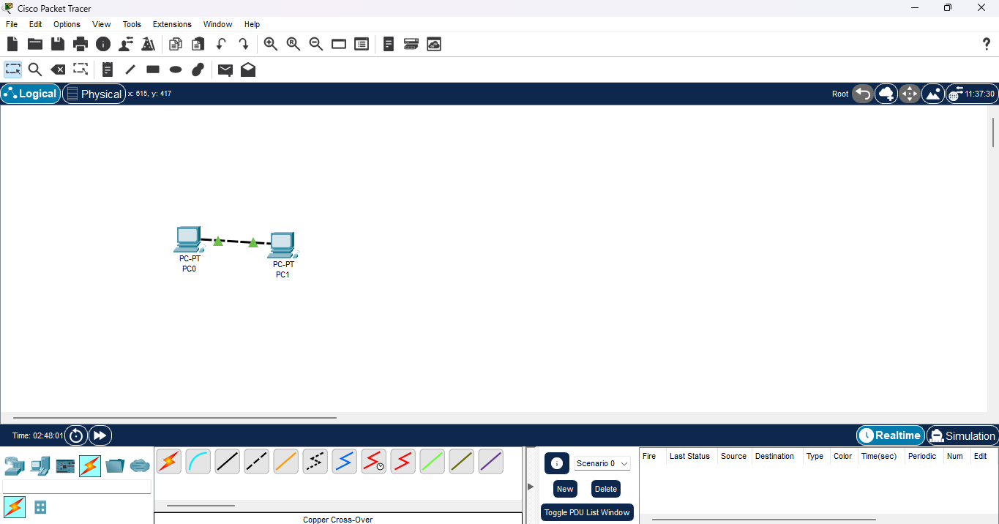
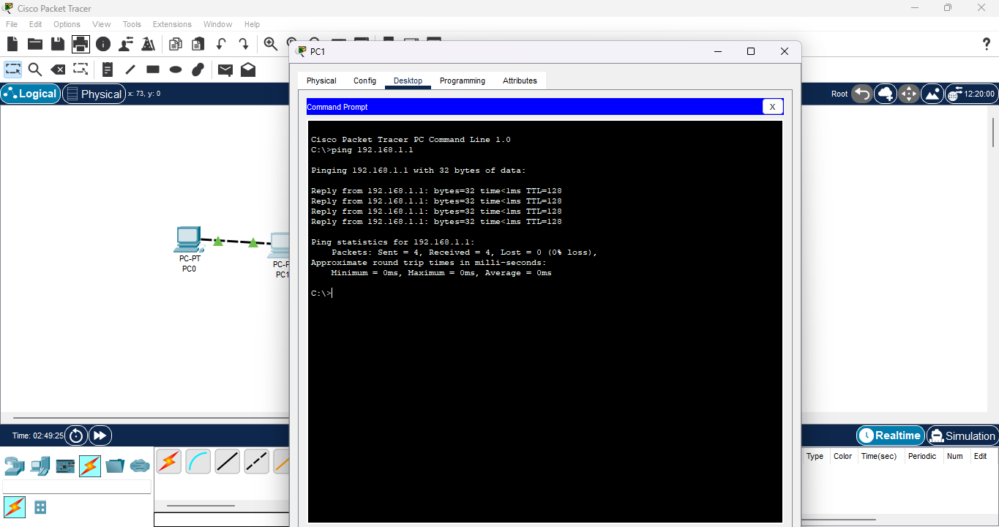

# Lab 01: First LAN + Ping Test **Date:** 2025-09-27 **Tool:** Cisco Packet Tracer 8.x --- ## 🎯 Goal Build a simple LAN with two PCs, assign IP addresses, and test connectivity using ping. --- ## 🛠️ Steps 1. Dragged **PC0** into the workspace.  2. Assigned static IP: 192.168.1.1 / 255.255.255.0  3. Tried `ping 192.168.1.1` → self-ping failed (Packet Tracer limitation).  4. Added **PC1**, assigned IP 192.168.1.2 / 255.255.255.0.   5. Connected PC0 ↔ PC1 with **Copper Cross-Over Cable (FastEthernet0)**.  6. From PC0, pinged 192.168.1.2 → **Success**.  --- ## ✅ Results - Green link lights confirmed connectivity. - Inter-device pings successful. - Self-pings failed (by design in Packet Tracer). --- ## 🔑 Key Takeaways - Built first LAN using Class C private IPs. - Cross-over cable is required for PC↔PC. - Ping validated end-to-end connectivity.