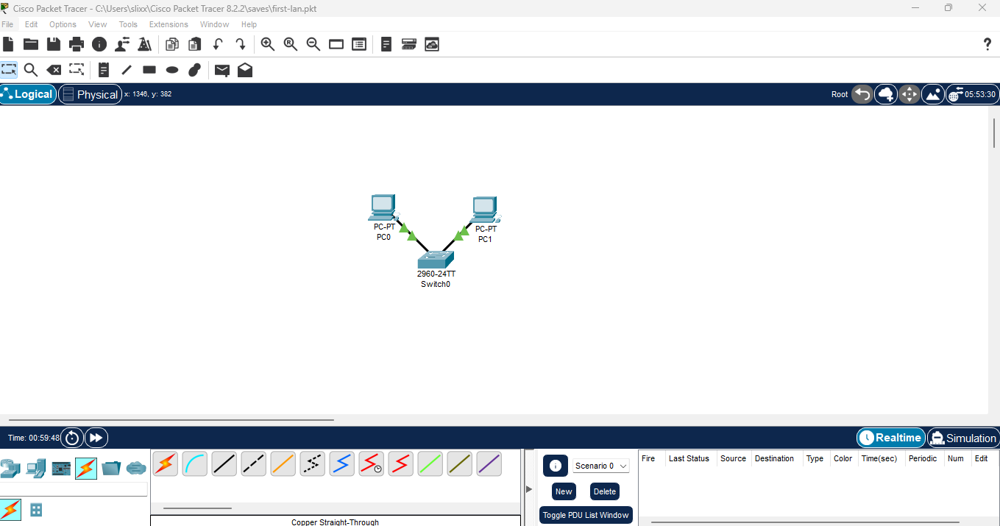
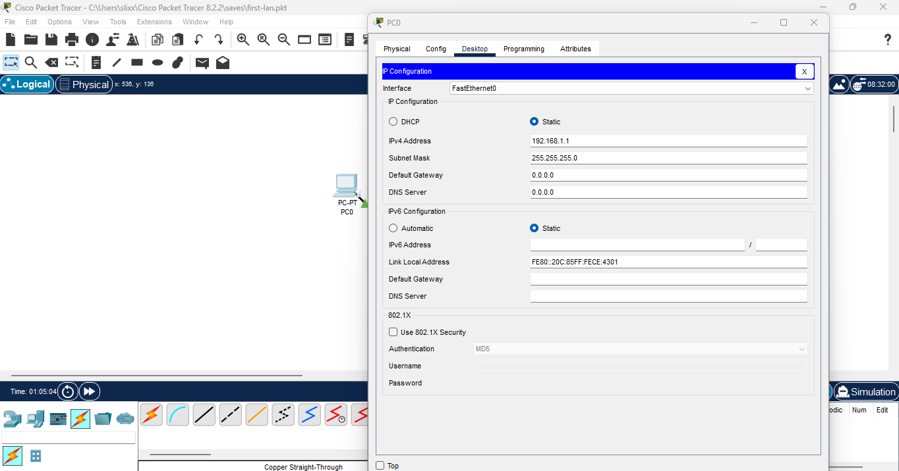
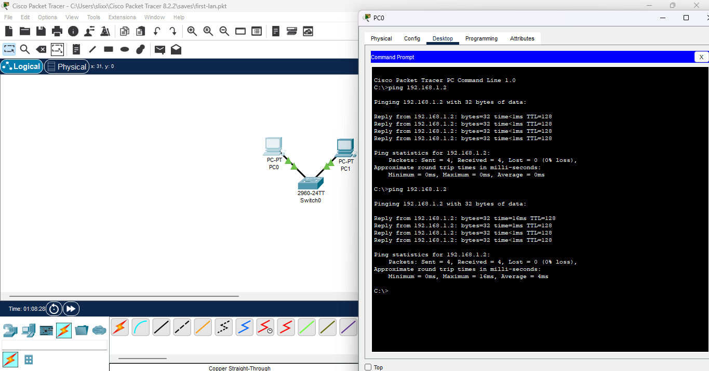
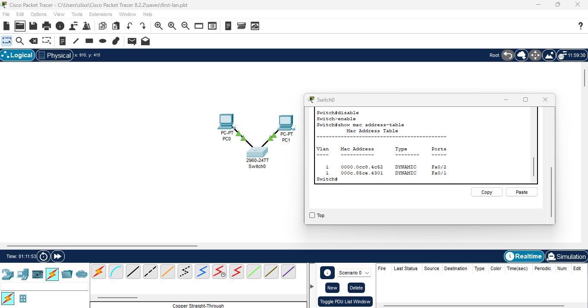

# Lab 02: LAN with a Switch **Date:** 2025-10-04 **Tool:** Cisco Packet Tracer 8.x --- ##Goal Build a simple LAN using a switch instead of a direct crossover connection, and observe how it learns MAC addresses. --- ## 🛠️ Steps 1. Placed **PC0**, **PC1**, and a **2960 switch** on the workspace.  2. Connected both PCs to the switch using **Copper Straight-Through** cables. - PC0 → Fa0/1 - PC1 → Fa0/2  3. Assigned IP addresses: - PC0 → 192.168.1.1 / 255.255.255.0 - PC1 → 192.168.1.2 / 255.255.255.0   4. From **PC0**, pinged **192.168.1.2** → Successful replies received.  5. On the switch CLI, ran the following command to view learned addresses: Switch> enable Switch# show mac address-table  --- ## ✅ Results - Switch dynamically learned the MAC addresses of both PCs. - Ping between PCs succeeded through the switch. - Replaced the need for a crossover cable with proper switching. --- ## 🔑 Key Takeaways - **Straight-through** cables connect PCs to switches. - Switches operate at **Layer 2 (Data Link)** and use **MAC address learning**. - This setup represents the foundation of real-world LAN communication.