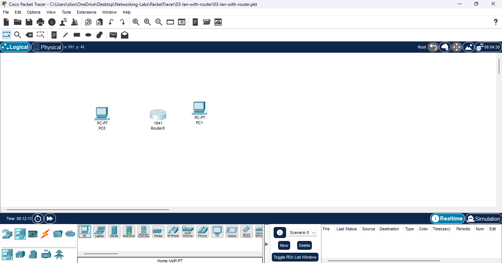
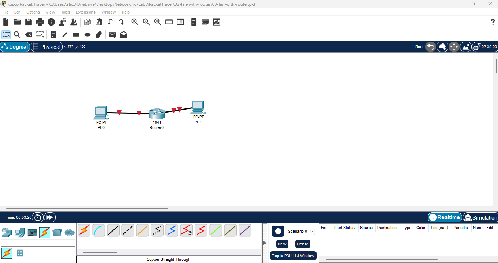
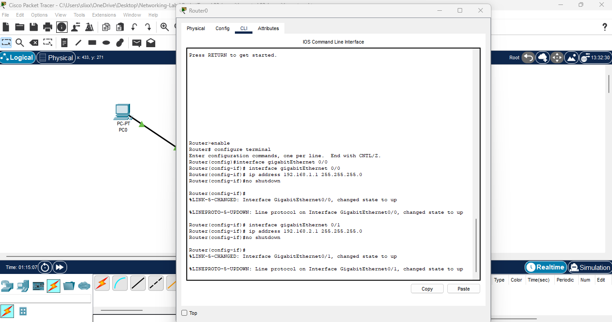
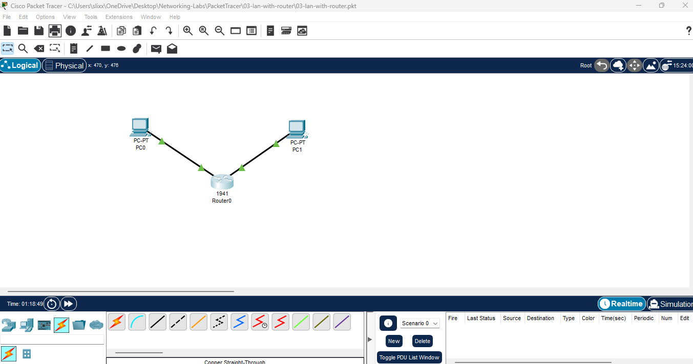
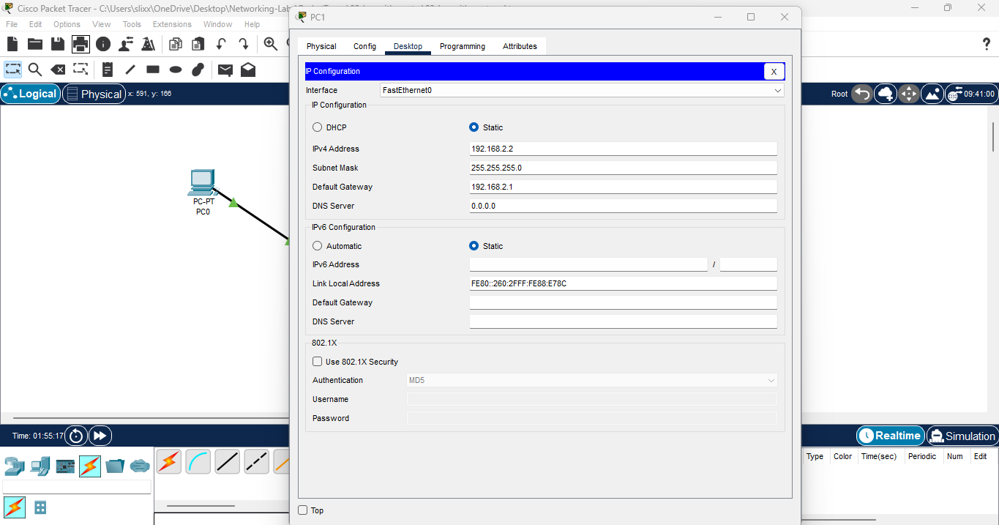
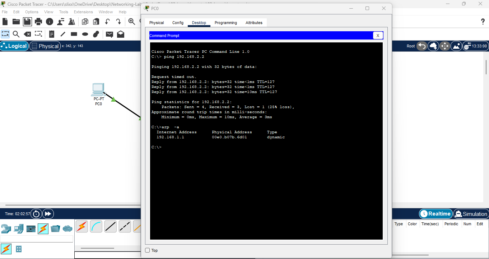
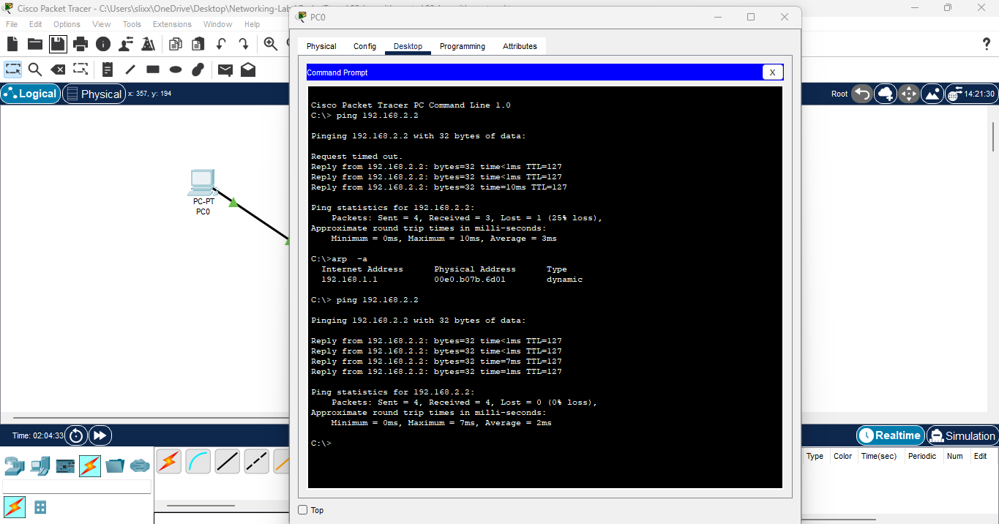
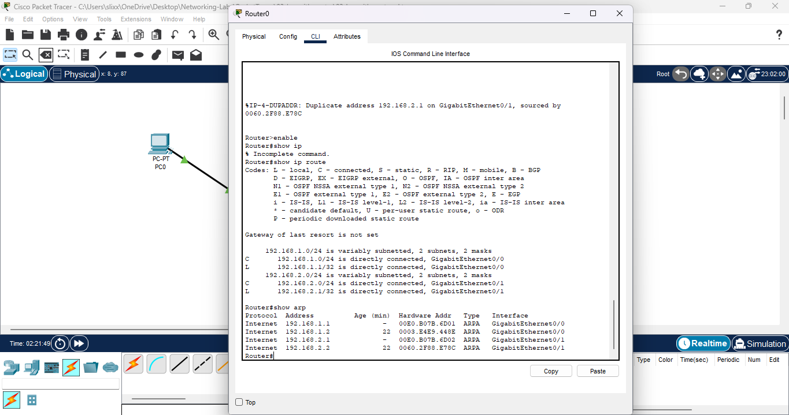

# Lab 03: LAN with Router (Gateway Intro)

**Date:** 2025-11-05  
**Tool:** Cisco Packet Tracer 8.x  

---

## 🎯 Goal
Connect two separate LANs using a router as the default gateway and verify cross-subnet communication.

---

## 🛠️ Steps
1. Placed **PC0**, **Router 1941**, and **PC1** in the workspace.  
   

2. Connected PCs to the router using **Copper Straight-Through** cables  
   (PC0→Gi0/0, PC1→Gi0/1).  
   

3. Configured router interfaces with IPs and enabled them.  
   

4. Verified both interfaces were **up/up**.  
   

5. Assigned static IPs and default gateways to each PC.  
   - PC0 → 192.168.1.2 /24  GW 192.168.1.1  
   - PC1 → 192.168.2.2 /24  GW 192.168.2.1  
     
   

6. Tested ping from **PC0 → PC1** (first ping 1 lost = ARP delay).  
     
   Retested → 4 success.  
   

7. Verified reverse ping from **PC1 → PC0**.  
   

8. Checked router tables.  
   

---

## ✅ Results
- Router correctly routed packets between **192.168.1.0/24** and **192.168.2.0/24**.  
- ARP learning confirmed at both router interfaces.  
- First ICMP packet dropped due to ARP, subsequent pings succeeded.  

---

## 🔑 Key Takeaways
- Each subnet needs its **own gateway** (router interface).  
- PCs must point to that gateway for off-network traffic.  
- The router’s `show ip route` shows directly-connected networks.  
- ARP resolves MAC addresses before communication starts.
