# Lab 04: Basic LAN with NAT & DNS Simulation

**Date:** 2025-11-10  
**Tool:** Cisco Packet Tracer 8.x  

---

## 🎯 Goal
Configure a small LAN that connects to a simulated Internet server through NAT.  
Prove that private IPs (192.168.10.0/24) can reach an outside host using **PAT (Port Address Translation)**.

---

## 🛠️ Steps

1. Placed **Router 2911**,  in the workspace.  
   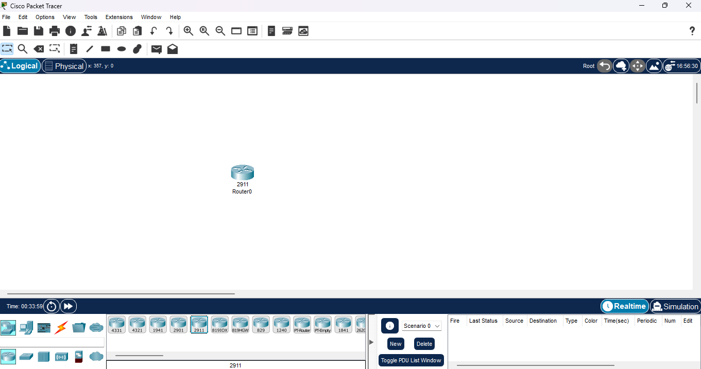

2. Verified router interfaces **G0/0**, **G0/1**, **G0/2** were available for configuration.  
   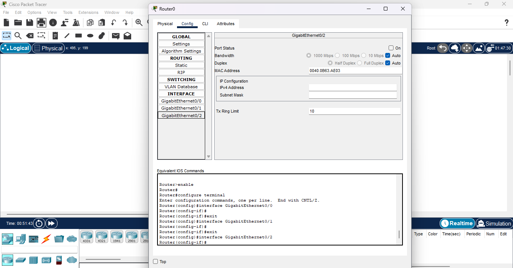

3. Placed  **Switch**, **PC0**, and **PC1** into workplace and connected **PC0** and **PC1** to the switch using **Copper Straight-Through** cables (PC0 → Fa0/1, PC1 → Fa0/2).  
   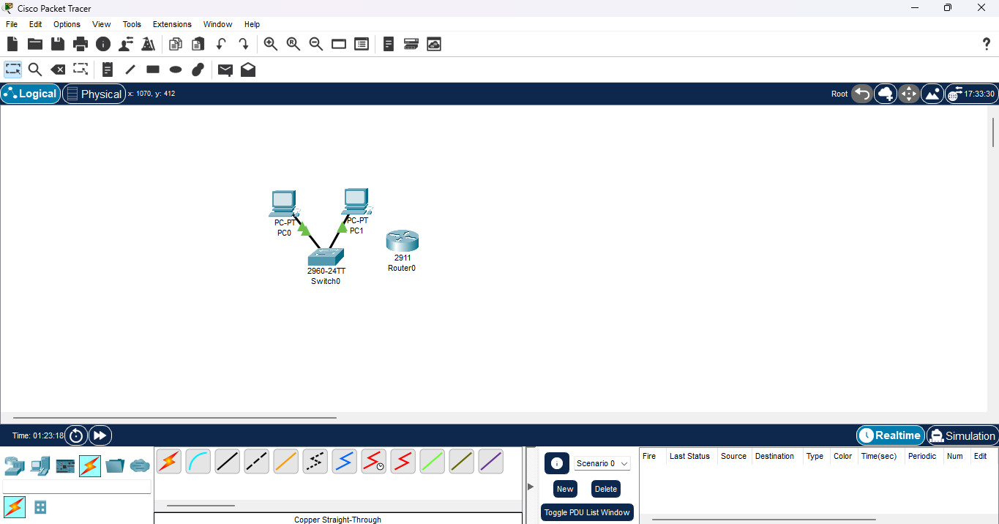

4. Assigned static IPs and gateways to each PC.  
   - **PC0** → 192.168.10.10 /24 GW 192.168.10.1  
   - **PC1** → 192.168.10.11 /24 GW 192.168.10.1  
   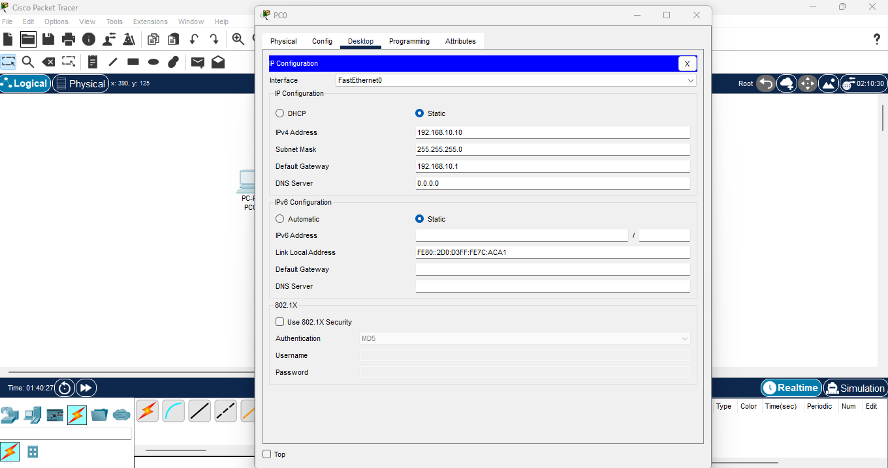  
   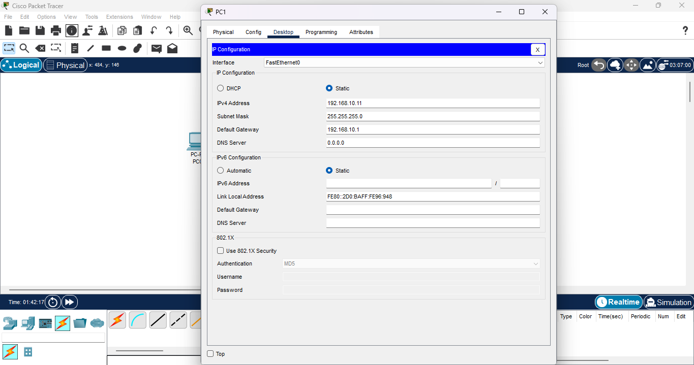

5. Configured **router G0/0** with IP 192.168.10.1 255.255.255.0 and enabled the interface.  
   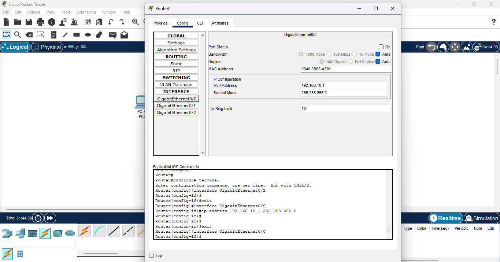

6. Connected **router G0/0** to switch Fa0/3 and confirmed **green link light**.  
   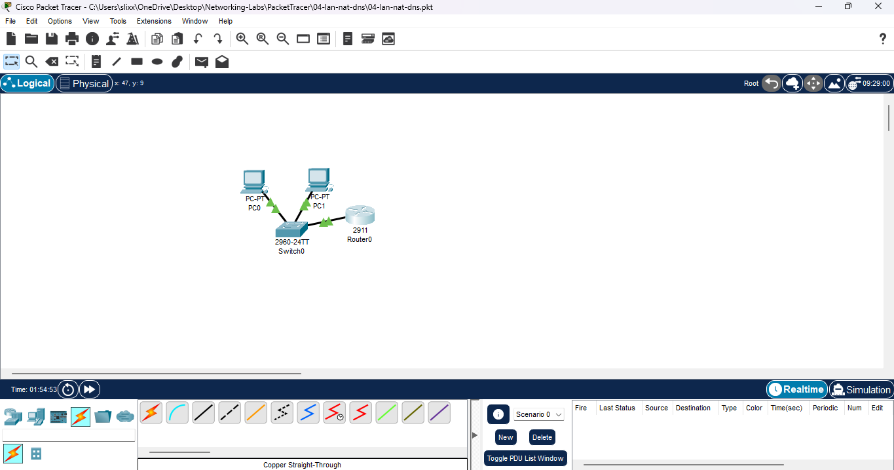

7. Tested LAN connectivity from **PC0 → PC1** and **PC0 → Router** using ping.  
   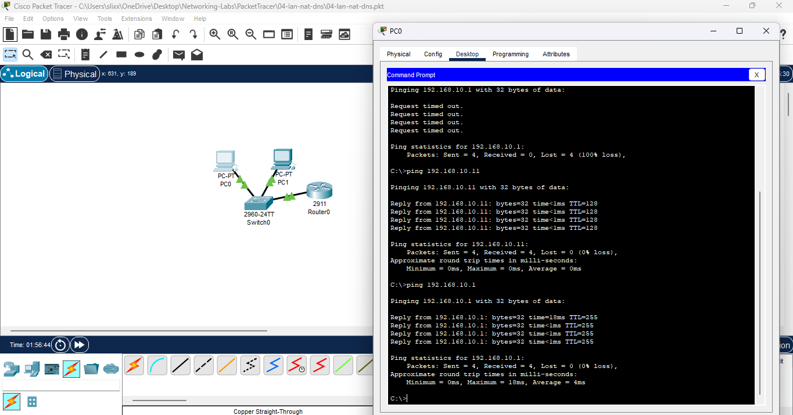

8. Configured **router G0/1** (WAN side) with IP 203.0.113.1 255.255.255.0.  
   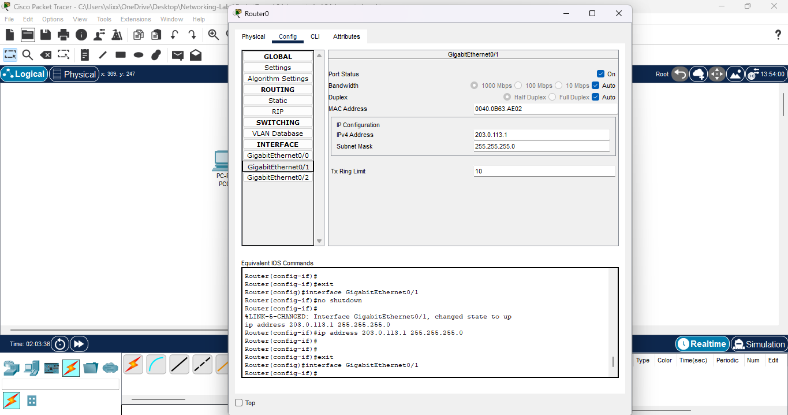

9. Added a simulated Internet/DNS **Server** and cabled **Server Fa0 → Router G0/1**.  
   Server IP 203.0.113.10 /24 GW 203.0.113.1  
   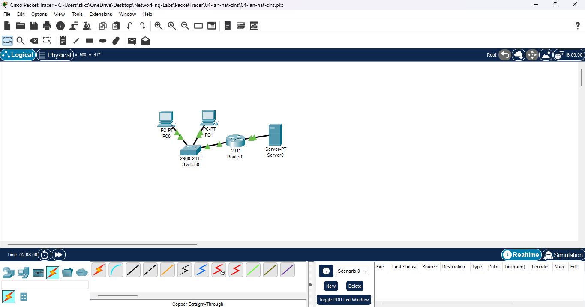

10. Verified router ↔ server connectivity using `ping 203.0.113.10` (success).  
    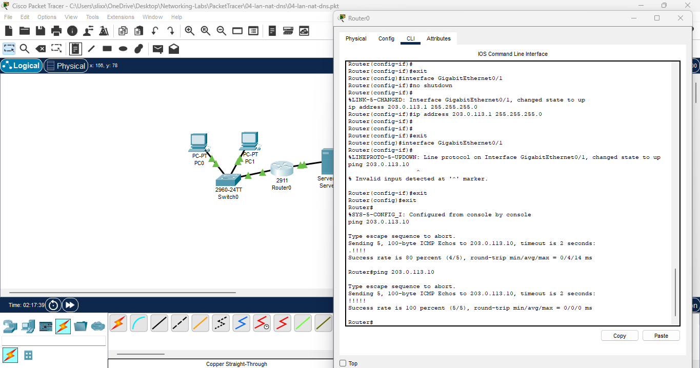

11. Configured **NAT (PAT)** with ACL and inside/outside interfaces.  
    ```bash
    access-list 1 permit 192.168.10.0 0.0.0.255
    ip nat inside source list 1 interface GigabitEthernet0/1 overload
    interface GigabitEthernet0/0
      ip nat inside
    interface GigabitEthernet0/1
      ip nat outside
    ```
    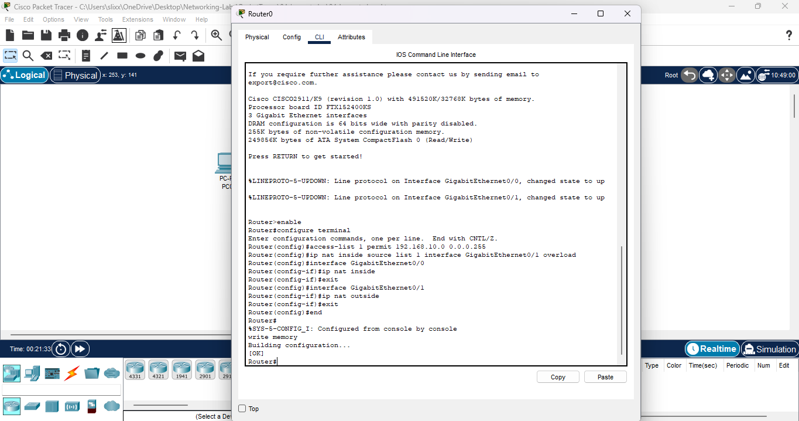

12. Final test – pinged external server **203.0.113.10** from **PC0** (success through NAT).  
    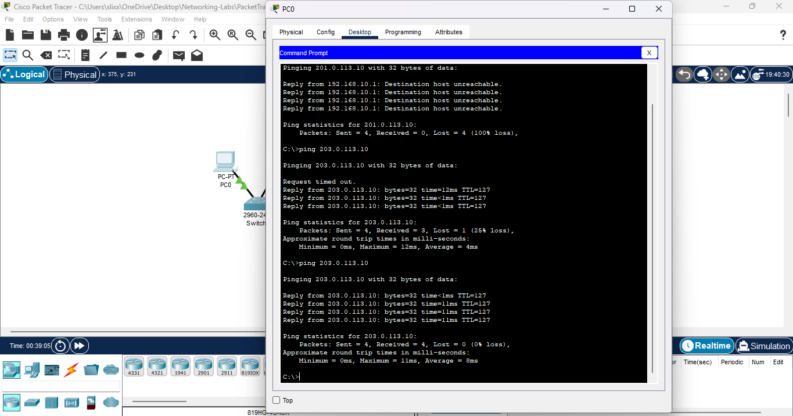

---

## ✅ Results
- PC0 and PC1 reached the external server through NAT.  
- Router translated 192.168.10.x → 203.0.113.1.  
- All interfaces up with green link lights and verified pings.

---

## 🔑 Key Takeaways
- **PAT (overload)** lets multiple LAN hosts share one public IP.  
- **Access Lists** specify which private IPs are translated.  
- Proper **inside/outside** designations are mandatory.  
- Test in order → LAN → Router → WAN → NAT.  
- Use **203.0.113.0/24** for safe Internet simulation (no live conflicts).
