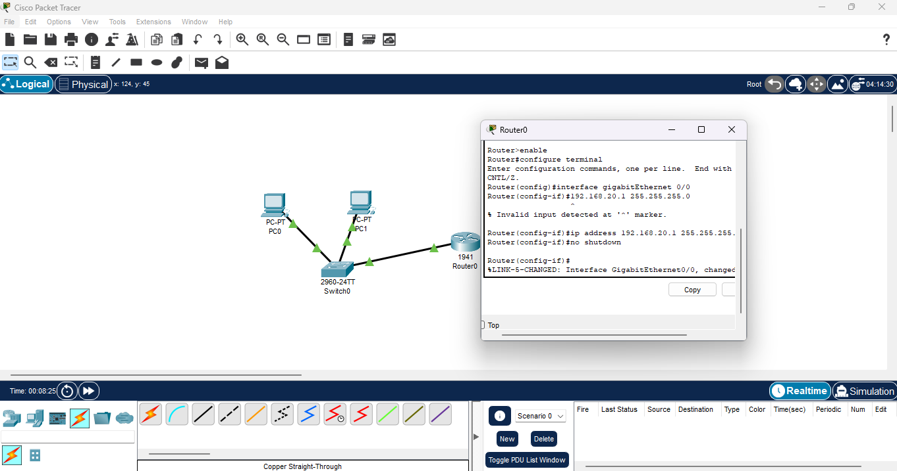
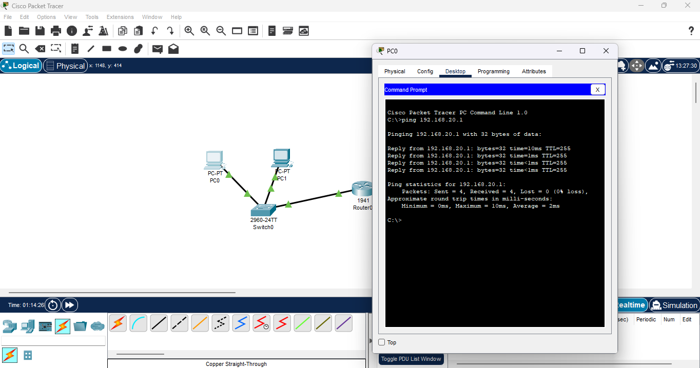
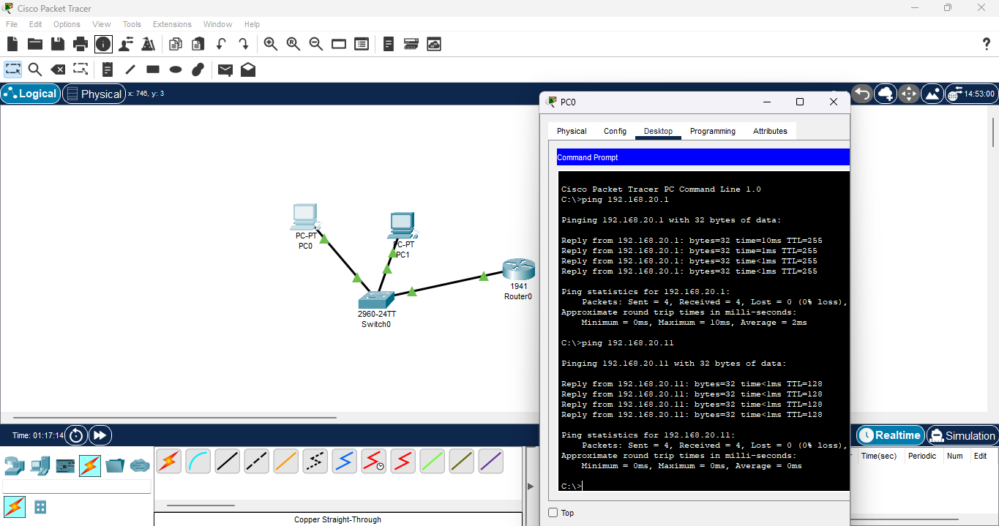

# Lab 05: DHCP & Dynamic Addressing  

**Date:** 2025-11-10  
**Tool:** Cisco Packet Tracer 8.x  

---

## 🎯 Goal  
Configure a LAN that automatically assigns IP addresses using a router acting as a DHCP server.  
Verify that LAN devices receive IPs, gateway, and DNS information dynamically and can communicate successfully.  

---

## 🛠️ Steps  

1. Placed **Router 1941**, **Switch 2960**, **PC0**, and **PC1** in the workspace and confirmed all links turned green.  
     

2. Configured router interface **G0/0** with IP `192.168.20.1 255.255.255.0` and enabled it using `no shutdown`.  
     

3. Created DHCP pool **LANPOOL** and excluded reserved addresses:  
   - **Network:** 192.168.20.0 255.255.255.0  
   - **Gateway:** 192.168.20.1  
   - **DNS:** 8.8.8.8  
   - **Excluded:** 192.168.20.1 – 192.168.20.9  
     

4. Verified **PC0** and **PC1** automatically received IP leases from the router.  
     
     

5. Tested LAN connectivity:  
   - **PC0 → Router (192.168.20.1)** ✅  
   - **PC0 ↔ PC1 (192.168.20.x range)** ✅  
     
     

6. Verified DHCP lease bindings on the router using `show ip dhcp binding`.  
     

---

## ✅ Results  
- Router dynamically assigned IPs to both PCs.  
- Clients automatically received subnet mask, gateway, and DNS.  
- Successful pings proved full LAN connectivity without manual configuration.  

---

## 🔑 Key Takeaways  
- **DHCP** automates IP assignment and prevents conflicts.  
- **Excluded addresses** reserve static IPs for network devices.  
- `show ip dhcp binding` verifies active leases.  
- Automation = efficiency + scalability in real-world LAN management.  
