# Lab 06: VLAN Segmentation & Inter-VLAN Routing (Router-on-a-Stick)

**Date:** 2025-11-10  
**Tool:** Cisco Packet Tracer 8.x  

---

## 🎯 Goal
Segment a LAN into two VLANs (Sales & HR), assign ports to the correct VLAN, configure trunking, create router sub-interfaces, and test inter-VLAN communication.

---

## 🧠 Concepts Learned
- VLAN creation & port assignment  
- Access ports vs trunk ports  
- 802.1Q tagging  
- Router-on-a-stick (sub-interfaces)  
- Inter-VLAN routing  
- Same-VLAN vs cross-VLAN connectivity tests  

---

## 🛠️ Steps

### 1️⃣ Built the topology and cabled all devices  
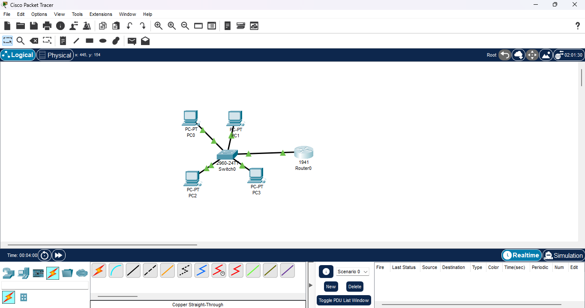

---

### 2️⃣ Created VLANs and assigned ports  
VLAN 10 → Sales (Fa0/1–Fa0/2)  
VLAN 20 → HR (Fa0/3–Fa0/4)  

**VLAN creation screenshot:**  
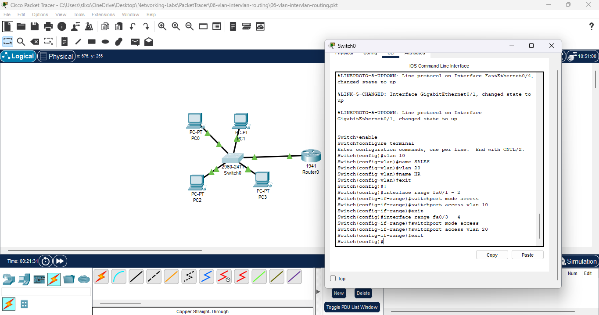

**Port assignment verification:**  
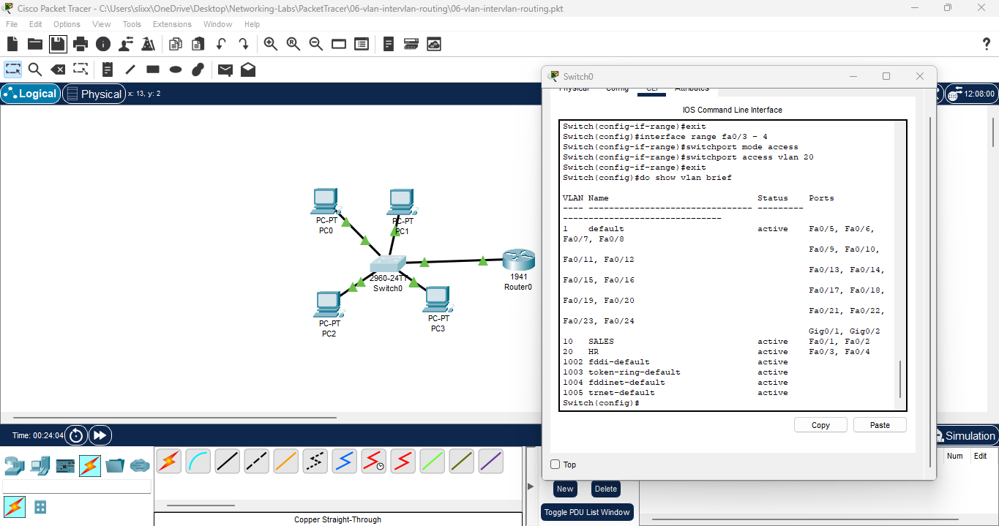

---

### 3️⃣ Configured trunk link on switch Gi0/1  
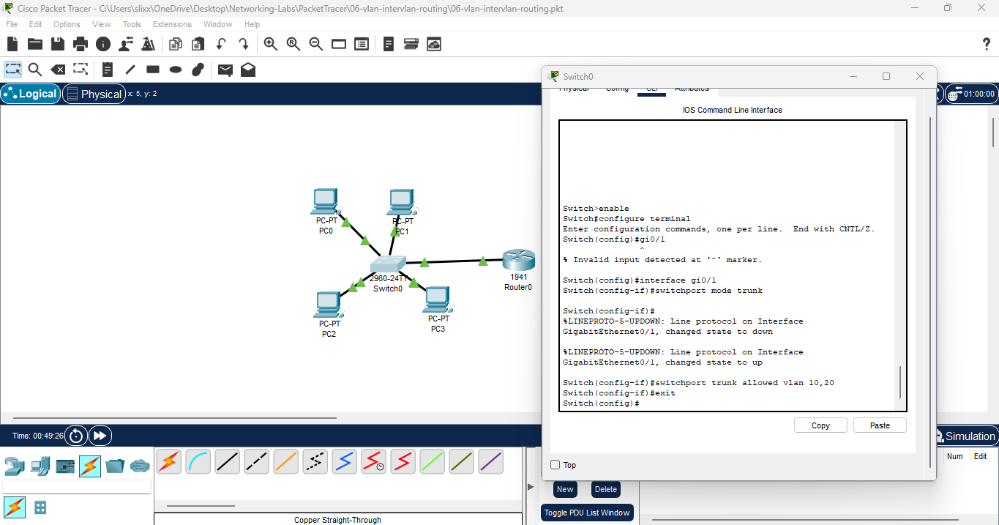

---

### 4️⃣ Configured router sub-interfaces  
- G0/0.10 → 192.168.10.1 /24 (VLAN 10)  
- G0/0.20 → 192.168.20.1 /24 (VLAN 20)  

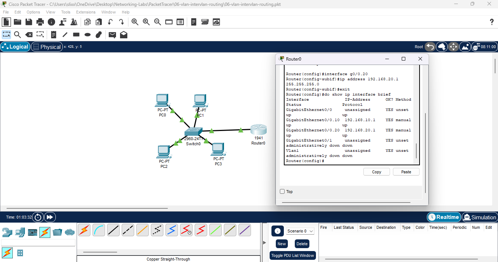

---

### 5️⃣ Assigned IP addresses to all PCs  
**VLAN 10 – PC0 & PC1:**  
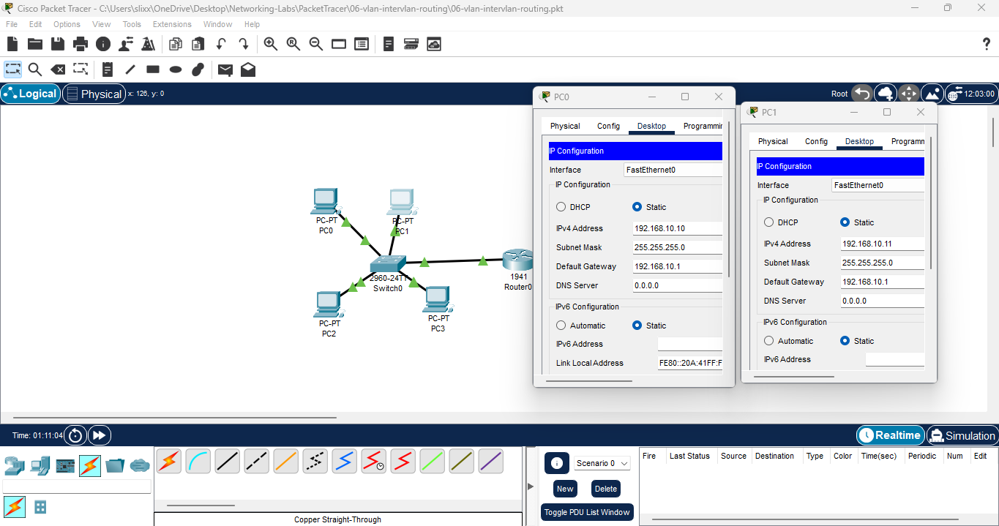

**VLAN 20 – PC2 & PC3:**  
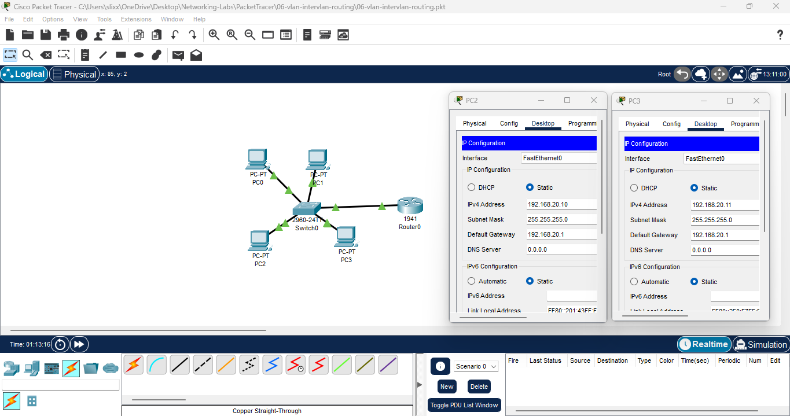

---

### 6️⃣ Tested connectivity (same VLAN + inter-VLAN)  
- VLAN 10 devices can ping each other  
- VLAN 20 devices can ping each other  
- VLAN 10 ↔ VLAN 20 can ping across VLANs via router  

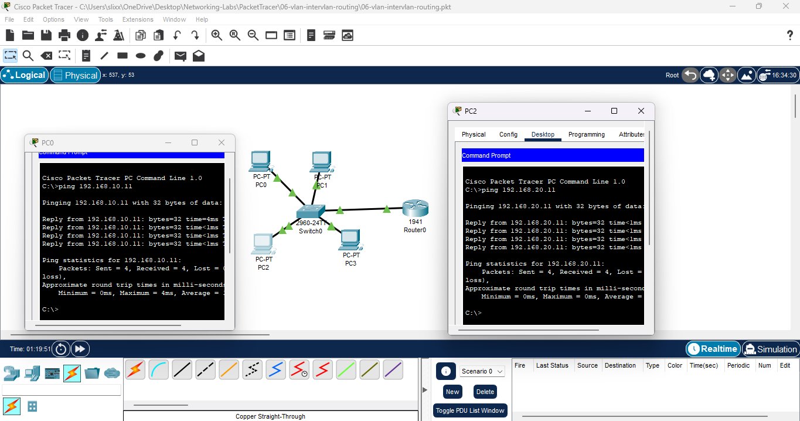  
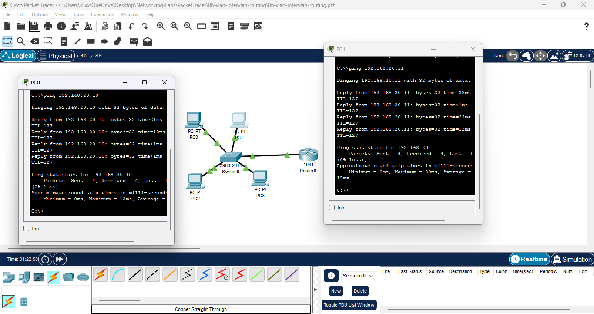

---

### 7️⃣ Verification commands  
**Switch VLAN table:**  
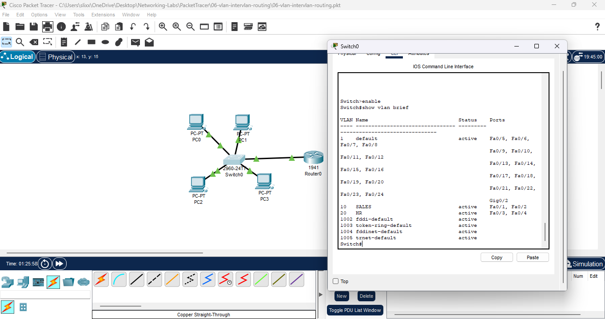

**Switch trunk status:**  
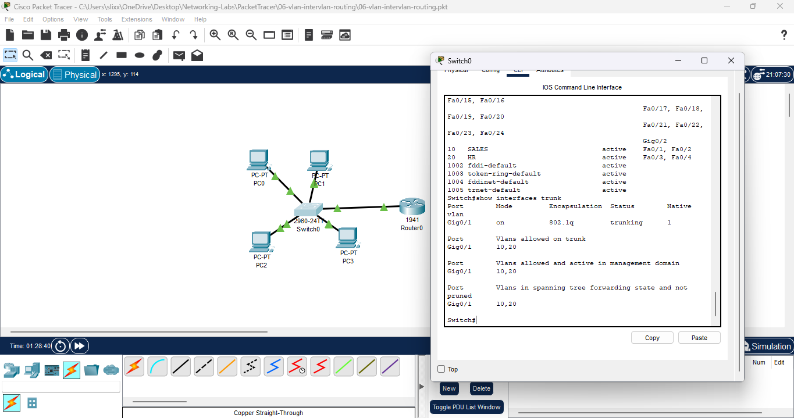

**Router interface summary:**  
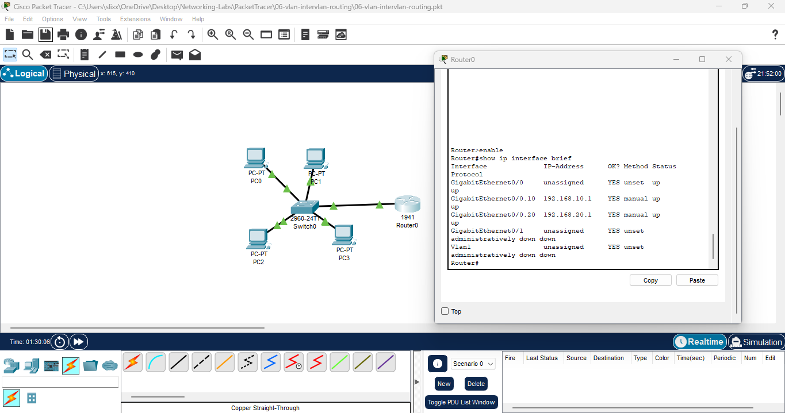

**Router routing table:**  
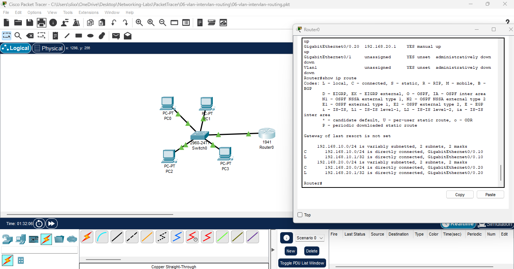

**Router ARP table:**  
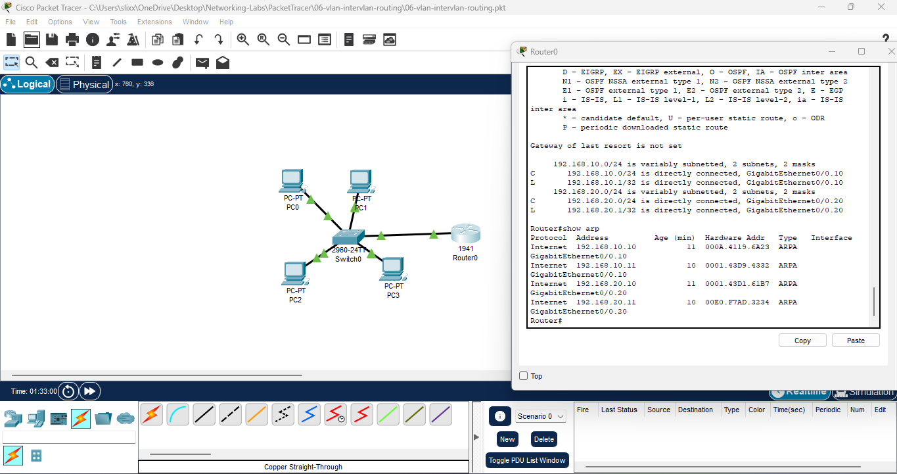

---

## ✅ Results
- VLAN segmentation fully operational  
- Trunk link successfully carrying VLAN 10 & 20  
- Router performing inter-VLAN routing  
- All pings successful in same VLAN and across VLANs  

---

## 🔑 Key Takeaways
- VLANs separate broadcast domains and isolate departments.  
- Access ports = 1 VLAN.  
- Trunk ports carry **multiple VLANs** using 802.1Q tags.  
- Sub-interfaces allow a single router port to route between VLANs.  
- Inter-VLAN routing is how real networks segment and secure traffic.

---

