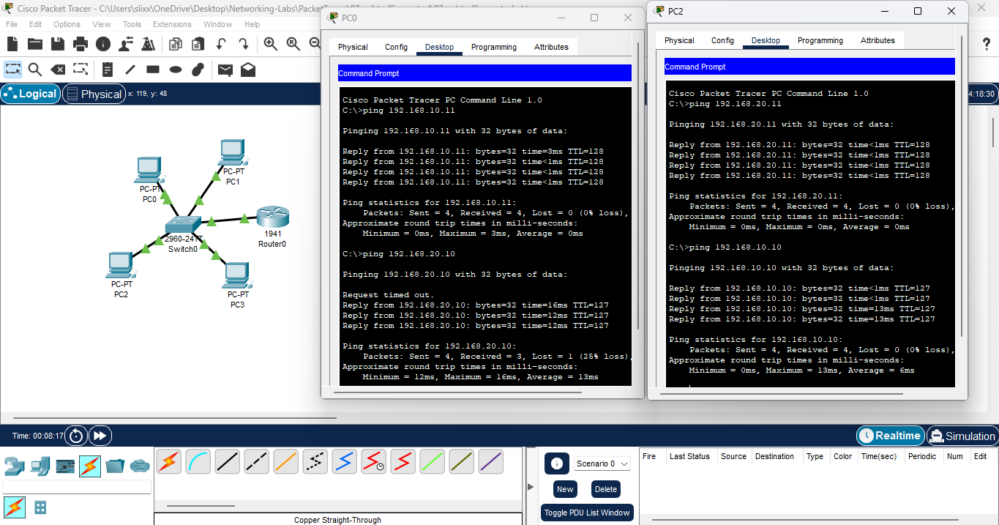
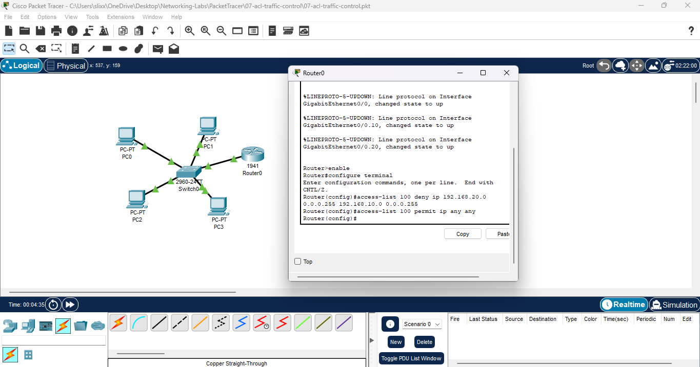
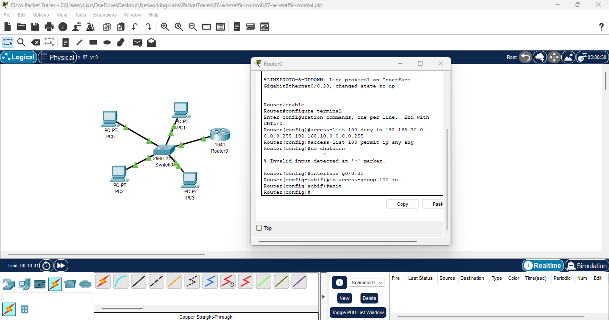
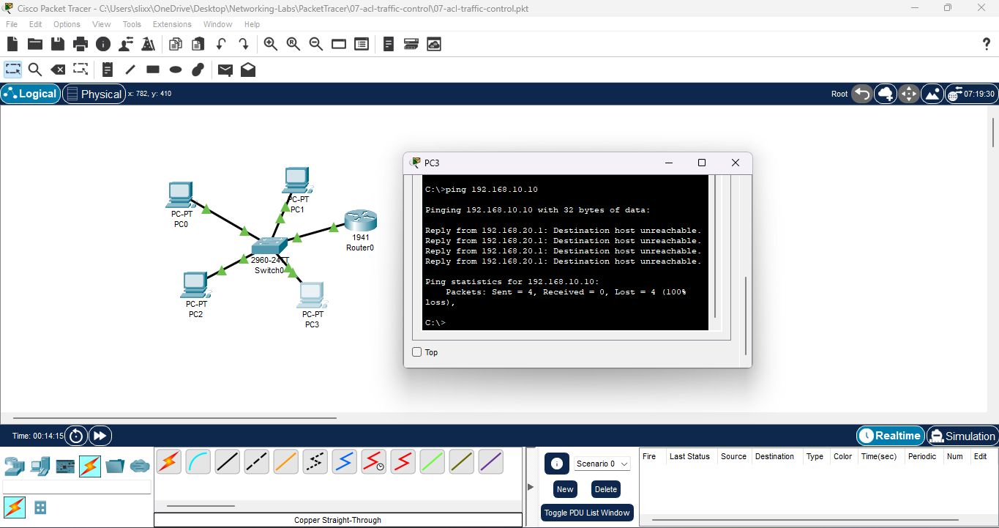
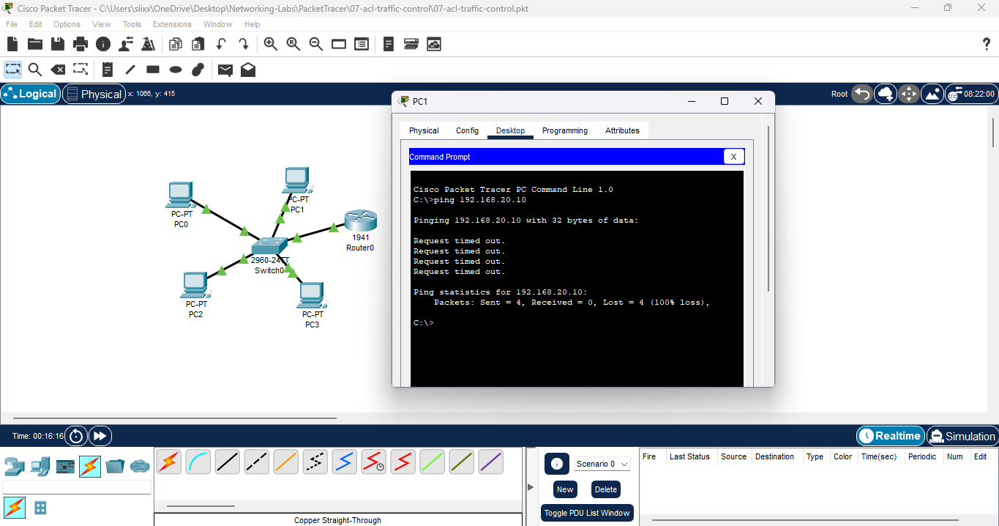
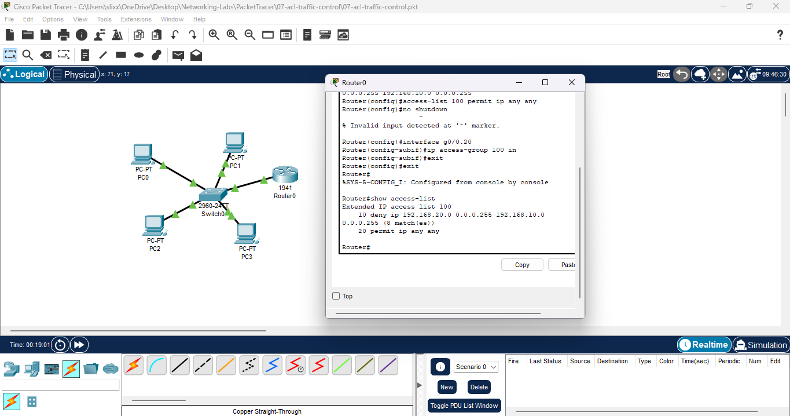

# **Lab 07: ACL Traffic Control (One-Way Inter-VLAN Security)**

**Date:** 2025-11-11  
**Tool:** Cisco Packet Tracer 8.x

---

## 🎯 **Goal**

Create an ACL that **blocks VLAN 20 → VLAN 10**, while still allowing  
**VLAN 10 → VLAN 20**.  
This mirrors real company security — lower-trust VLANs cannot access higher-trust VLANs.

---

# 🛠️ **Steps**

---

## **1. Verified baseline connectivity (before ACL)**

- VLAN 10 ↔ VLAN 20 communication worked normally
    
- Inter-VLAN routing active
    
- No restrictions yet
    

**File:** 

---

## **2. Created extended ACL 100 (block VLAN 20 → VLAN 10)**

The ACL rules:

- **DENY** traffic from VLAN 20 subnet → VLAN 10 subnet
    
- **PERMIT** everything else so routing continues normally
    

**File:**   

---

## **3. Applied ACL inbound on router sub-interface g0/0.20**

Why inbound?  
Because traffic must be filtered **as it enters the router** from VLAN 20.

**File:**   

---

## **4. Tested VLAN 20 → VLAN 10 (should FAIL)**

- Ping from VLAN 20 to VLAN 10 was blocked
    
- ACL successfully stopped the traffic
    

**File:**   

---

## **5. Tested VLAN 10 → VLAN 20 (should WORK)**

- Ping from VLAN 10 to VLAN 20 succeeded
    
- This direction is allowed, as expected
    

**File:**   

---

## **6. Verified ACL + interface binding**

- `show access-lists` confirmed ACL 100 rules
    
- `show ip interface g0/0.20` confirmed ACL was applied inbound
    

**File:**   

---

# ✅ **Results**

- VLAN 20 → VLAN 10 **blocked**
    
- VLAN 10 → VLAN 20 **allowed**
    
- ACL correctly applied to inbound direction
    
- One-way VLAN security fully implemented
    

---

# 🔑 **Key Takeaways**

- ACLs require **correct placement + direction**
    
- Extended ACLs filter by _source + destination_
    
- Inbound filtering stops traffic before it is routed
    
- This is how real companies isolate sensitive VLANs