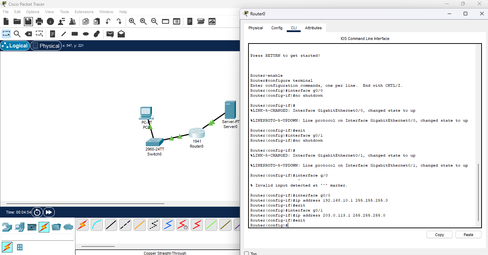
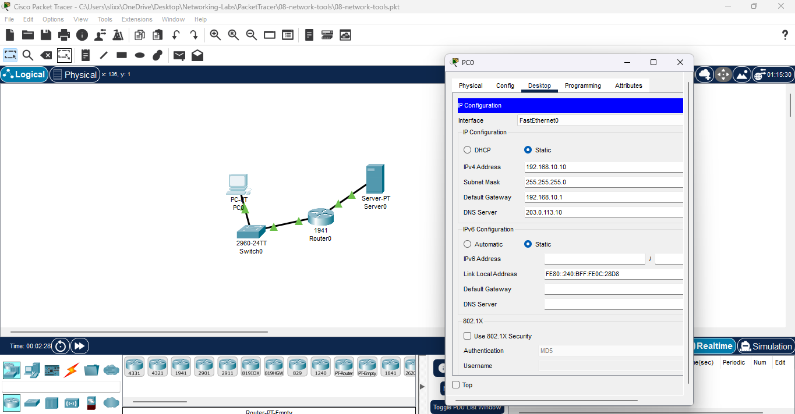
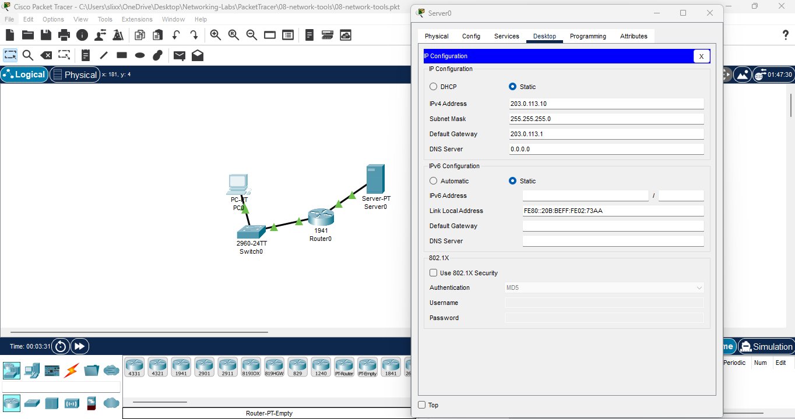
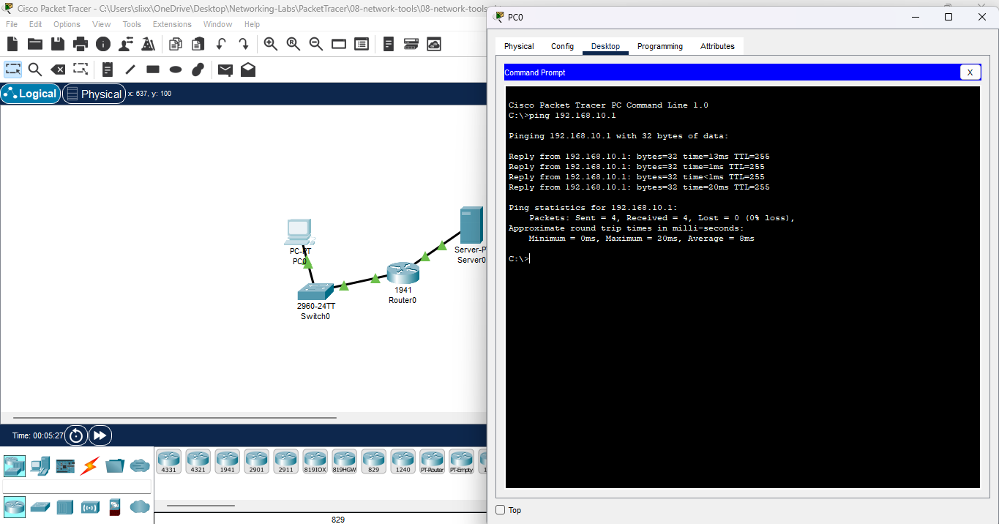
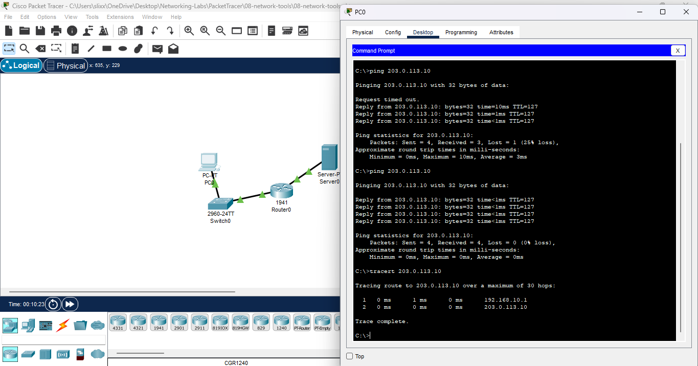
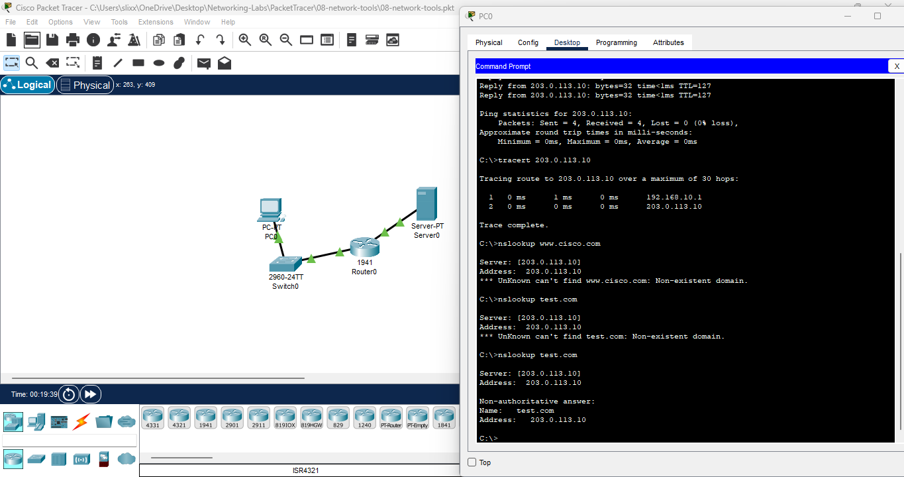

# **Lab 08: Ping, Traceroute & DNS Lookup Troubleshooting**

**Date:** 2025-11-XX  
**Tool:** Cisco Packet Tracer 8.x

---

## 🎯 Goal

Use real troubleshooting tools:

- **Ping** (basic reachability)
    
- **Traceroute** (path discovery)
    
- **Nslookup** (DNS name resolution)

---

## 🛠️ Steps

---

### **1. Built the Mini Topology**

Devices used:

- Router (2911 or 1941)
    
- Switch (2960)
    
- PC
    
- Server (DNS enabled)
    

Connections:

- PC → Switch (straight-through)
    
- Switch → Router g0/0
    
- Server → Router g0/1
    

**Screenshot:**   
 

---

### **2. Configured Router Interfaces**

- **g0/0 → LAN:** 192.168.10.1 /24
    
- **g0/1 → WAN:** 203.0.113.1 /24
    
- Enabled both with `no shutdown`
    
- Verified green link lights on LAN & WAN
    

**Screenshot:**  
 

---

### **3. Assigned IP Settings to PC & Server**

#### **PC (LAN):**

- IP: 192.168.10.10
    
- Mask: 255.255.255.0
    
- Gateway: 192.168.10.1
    
- DNS: 203.0.113.10
    

#### **Server (WAN):**

- IP: 203.0.113.10
    
- Mask: 255.255.255.0
    
- Gateway: 203.0.113.1
    
- DNS Service ON
    
- Added A-Record:
    
    - Name: **test.com**
        
    - Address: **203.0.113.10**
        

**Screenshot:**  

  

---

### **4. Ping Testing — Connectivity Verification**

#### **Ping Gateway (Router g0/0)**

`ping 192.168.10.1`

✔️ Successful → LAN side working.

**Screenshot:**  

---

#### **Ping Server (203.0.113.10)**

`ping 203.0.113.10`

✔️ Success → End-to-end routing confirmed.

**Screenshot:**  ![pc ping to server][./06-pc-ping-server.png]

---

### **5. Traceroute Testing**

Command:

`tracert 203.0.113.10`

Expected output:

- hop 1 = 192.168.10.1 (router)
    
- hop 2 = 203.0.113.10 (server)
    

**Screenshot:**  

---

### **6. DNS Testing (Nslookup)**

You first received DNS failures:

`Unknown Non-existent domain`

This is **normal** until the A-record was added.

After adding the record:

`nslookup test.com`

✔️ Success — DNS server resolved the hostname.

**Screenshot:**    

---

## ✅ Results

- PC successfully reached the router and server using **ping**
    
- Network path confirmed using **traceroute**
    
- DNS resolution succeeded after A-record creation
    
- Full LAN ↔ Router ↔ WAN flow verified
    

---

## 🔑 Key Takeaways

- Ping tests raw connectivity (Layer 3)
    
- Traceroute shows path hops (Layer 3 route inspection)
    
- Nslookup verifies DNS (Layer 7 name resolution)
    
- DNS will always fail until a map exists in the DNS serv