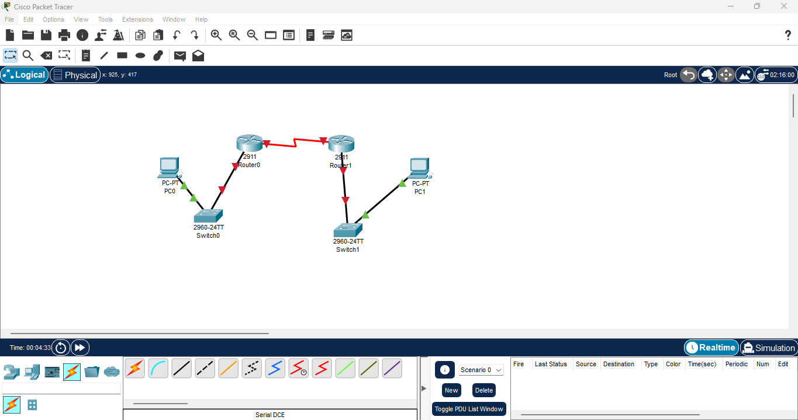
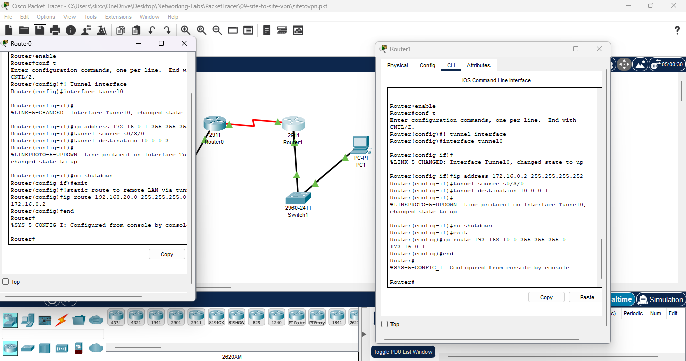
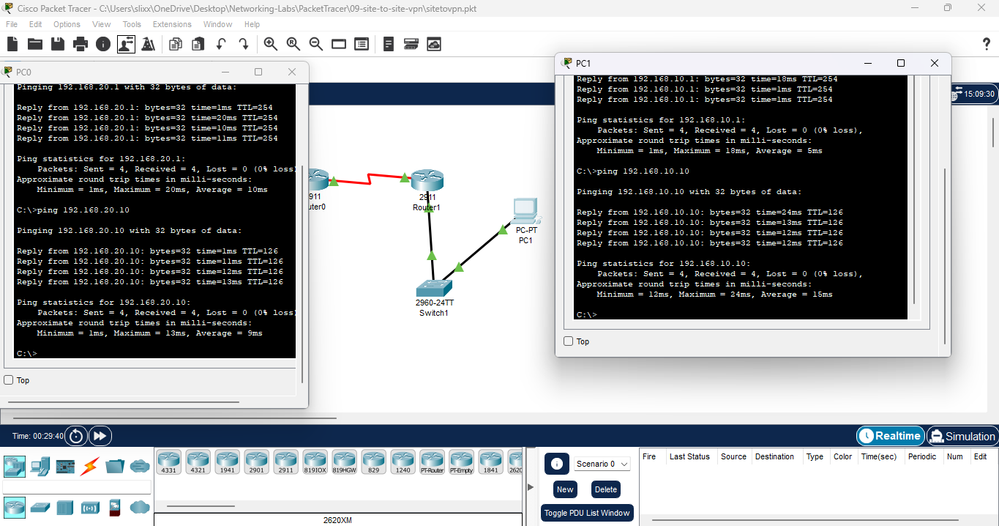

# Lab 09: Site-to-Site VPN (GRE Tunnel Simulation)

**Date:** 2025-11-10  
**Tool:** Cisco Packet Tracer 8.x

---

## 🎯 Goal

Build a **site-to-site VPN (GRE Tunnel)** between two routers so LAN-to-LAN traffic can pass securely across a WAN link.

- Serial WAN links (DCE/DTE)
    
- Static routing between sites
    
- GRE tunnel creation
    
- Router-to-router & LAN-to-LAN verification
    

---

## 🛠️ Steps

---

### **1. Built the topology and connected base devices**

- Added:
    
    - **Router0**, **Router1**
        
    - 2960 switches
        
    - PC0 and PC1
        
- Cabled each PC → switch → router
    

📸 **File:** !

---

### **2. Installed serial modules on both routers**

- Opened the **Physical tab**
    
- Removed the power from the router
    
- Installed **HWIC-2T** modules (adds Serial 0/3/0 & 0/3/1)
    
- Powered routers on
    

📸 **File:** `

---

### **3. Connected the serial DCE/DTE link between routers**

- Used **Serial DCE** cable
    
- Router0 end = DCE
    
- Router1 end = DTE
    
- Selected interfaces:
    
    - Router0 → **Serial0/3/0**
        
    - Router1 → **Serial0/3/0**
        
- Applied **clock rate 64000** on the DCE side
    

📸 **File:** 

---

### **4. Configured router WAN & LAN interfaces and brought them UP**

**Router0**

- `g0/0` → 192.168.10.1 /24
    
- `s0/3/0` → 10.0.0.1 /30
    
- `no shutdown` on both
    

**Router1**

- `g0/0` → 192.168.20.1 /24
    
- `s0/3/0` → 10.0.0.2 /30
    
- `no shutdown`
    

📸 **File:** 

---

### **5. Configured static routing on both routers**

**Router0**

`ip route 192.168.20.0 255.255.255.0 10.0.0.2`

**Router1**

`ip route 192.168.10.0 255.255.255.0 10.0.0.1`

📸 **File:** 

---

### **6. Verified router-to-router ping works**

- Router0 → ping 10.0.0.2
    
- Router1 → ping 10.0.0.1
    

📸 **File:** 

---

### **7. Created GRE tunnel interfaces on both routers**

**Router0 – Tunnel0**

`interface tunnel0  ip address 172.16.0.1 255.255.255.252  tunnel source serial0/3/0  tunnel destination 10.0.0.2  no shutdown`

**Router1 – Tunnel0**

`interface tunnel0  ip address 172.16.0.2 255.255.255.252  tunnel source serial0/3/0  tunnel destination 10.0.0.1  no shutdown`

📸 **File:** 

---

### **8. Tested tunnel connectivity**

- Ping from Router0 → 172.16.0.2
    
- Ping from Router1 → 172.16.0.1
    
- Tunnel interface changed to **UP**
    

📸 **File:** 

---

### **9. Tunnel UP state check**

- Used: `show interface tunnel0`
    

📸 **File:** 

---

### **10. Verified PC ping to local router gateways**

**PC0 → 192.168.10.1**  
**PC1 → 192.168.20.1**

📸 **File:** 

---

### **11. Tested LAN-to-LAN communication through the VPN**

- PC0 → ping **192.168.20.x**
    
- PC1 → ping **192.168.10.x**
    

📸 **File:** 

---

### **12. Verified tunnel interface status again**

- Tunnel should show:
    
    - **Line protocol: up**
        
    - **Mode: tunnel**
        

📸 **File:** 

---

### **13. Verified routing table entries**

Used:

`show ip route`

- Should show:
    
    - 172.16.0.0/30 via Tunnel0
        
    - Static routes for remote LANs
        

📸 **File:** 

---

## ✅ Final Result

- GRE tunnel successfully formed between Router0 and Router1.
    
- Serial WAN link functioning.
    
- Static routes correctly installed.
    
- PCs on **different LANs** can now communicate **through the VPN tunnel**