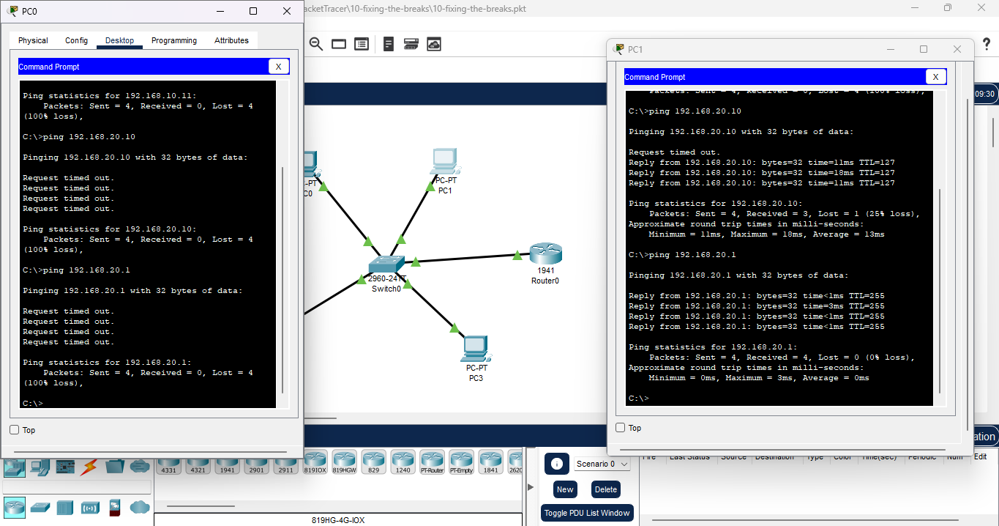
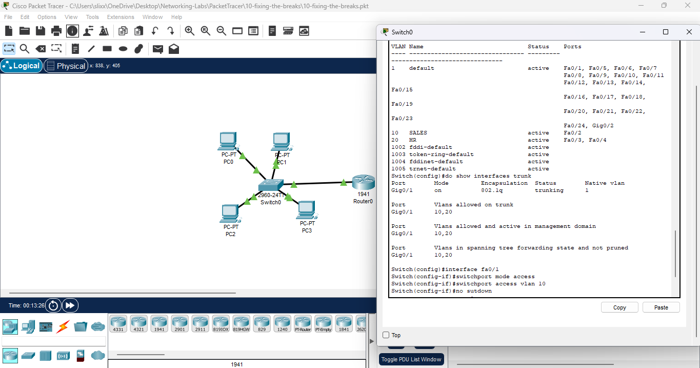
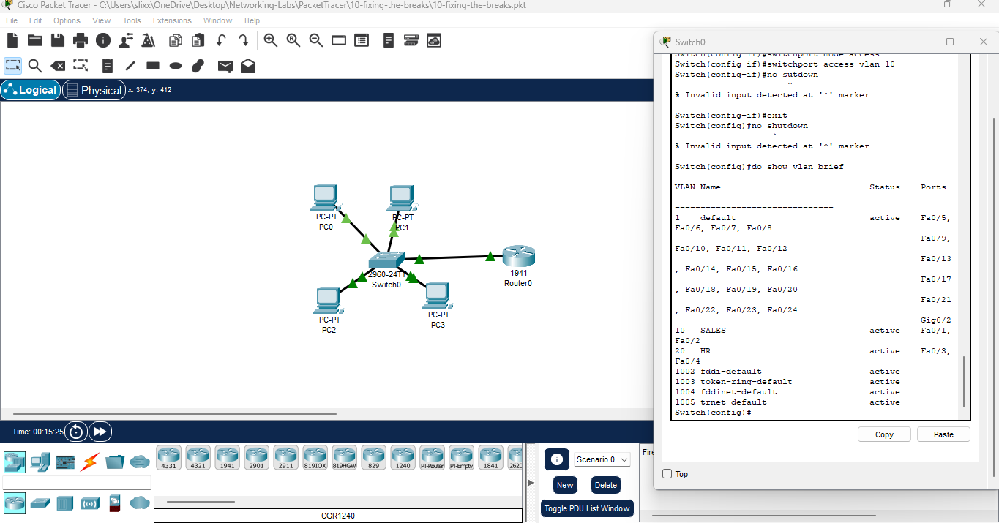
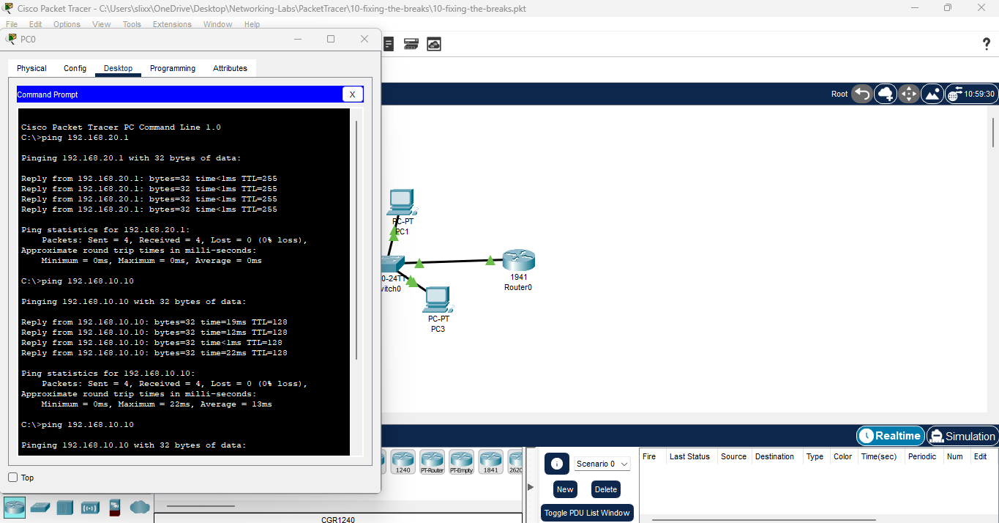
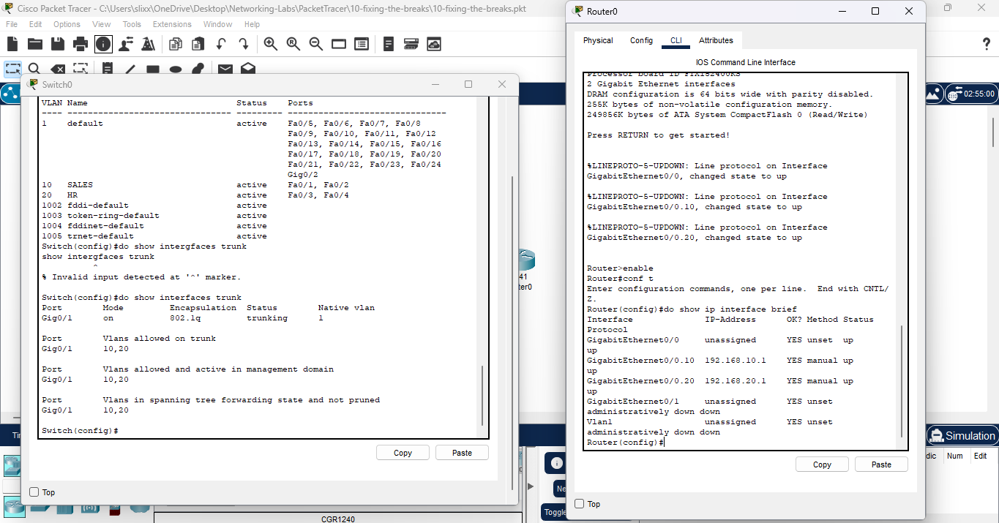
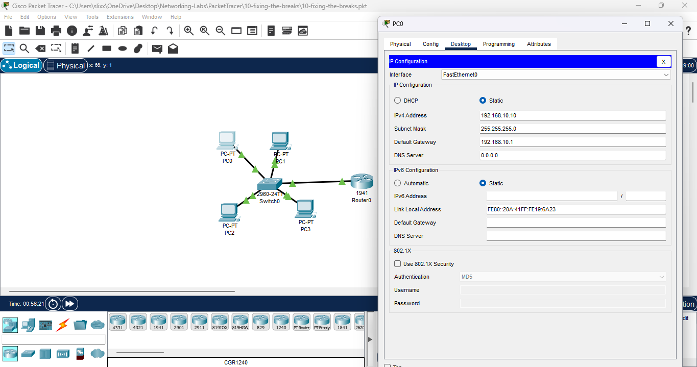
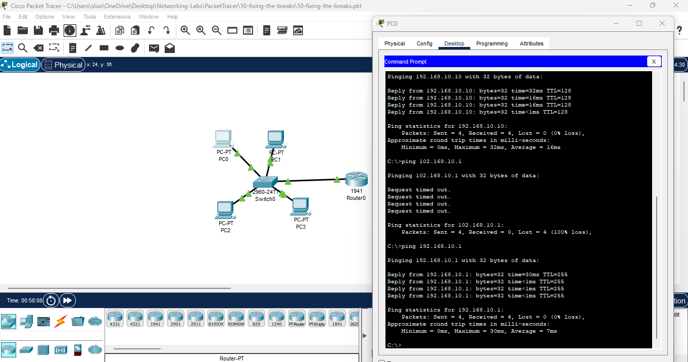

# Lab 10: Network Troubleshooting (Break & Fix Scenario)

**Date:** 2025-11  
**Tool:** Cisco Packet Tracer 8.x

---

## 🎯 Goal

Network troubleshooting** by diagnosing and fixing connectivity issues in an existing VLAN-based network.

This lab focuses on:

- Identifying failures using observation and verification commands
    
- Fixing configuration issues in the the network
    

---

## 🧠 Scenario

A small VLAN-based network is reported to have **partial connectivity**:

- One PC can reach its gateway
    
- Another PC cannot communicate properly
    
- VLAN behavior is inconsistent
    
- The network previously worked
    

---

## 🛠️ Troubleshooting Steps

---

### **1. Identified initial connectivity symptoms**

- PC1 could ping its gateway successfully
    
- PC0 failed to ping its gateway
    
- This indicated the issue was **not global**, but isolated
    

**File:**  

---

### **2. Checked VLAN assignments and trunking**

- Ran `show vlan brief`
    
- Verified which switch ports belonged to which VLANs
    
- Confirmed trunking was present and active
    

This step ruled out:

- Missing VLANs
    
- Trunk failures
    

**File:**  

---

### **3. Identified incorrect VLAN assignment on PC0 port**

- PC0’s switch port (Fa0/1) was in the wrong VLAN
    
- This explained why PC0 could not reach the correct gateway
    

**Fix applied:**

- Reassigned Fa0/1 to the correct VLAN
    

**File:**  

---

### **4. Verified VLAN correction**

- Re-ran `show vlan brief`
    
- Confirmed Fa0/1 was now in VLAN 10
    
- VLAN configuration now matched design
    

**File:**  

---

### **5. Verified restored connectivity**

- PC0 successfully pinged its gateway
    
- PC-to-PC communication was restored
    
- Network returned to expected behavior
    

**File:**  

---

### **6. Additional verification (gateway & interface checks)**

- Confirmed router subinterfaces were up
    
- Verified encapsulation matched VLAN IDs
    
- Confirmed default gateways were correct on PCs
    

**Files:**  
  
  

---

## ✅ Results

- Root cause was a **misassigned switch port VLAN**
    
- No routing, NAT, or ACL issues were present
    
- Fixing Layer 2 restored full Layer 3 connectivity
    
- Network stabilized